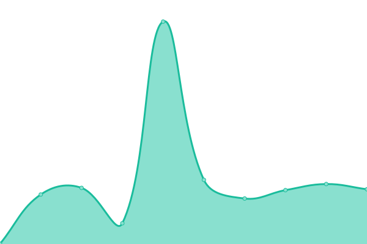

# [📈 Live Status](https://clone47.github.io/ecohub-processes-uptime): <!--live status--> **🟩 All systems operational**

This repository contains the open-source uptime monitor and status page for [Ayon Alfaz](https://clone47.github.io/ecohub-processes-uptime), powered by [Upptime](https://github.com/upptime/upptime).

With [Upptime](https://upptime.js.org), you can get your own unlimited and free uptime monitor and status page, powered entirely by a GitHub repository. We use [Issues](https://github.com/clone47/ecohub-processes-uptime/issues) as incident reports, [Actions](https://github.com/clone47/ecohub-processes-uptime/actions) as uptime monitors, and [Pages](https://clone47.github.io/ecohub-processes-uptime) for the status page.

<!--start: status pages-->
<!-- This summary is generated by Upptime (https://github.com/upptime/upptime) -->
<!-- Do not edit this manually, your changes will be overwritten -->
<!-- prettier-ignore -->
| URL | Status | History | Response Time | Uptime |
| --- | ------ | ------- | ------------- | ------ |
|  [Ecohub Processes](https://processes.myecohub.ch) | 🟩 Up | [ecohub-processes.yml](https://github.com/clone47/ecohub-processes-uptime/commits/HEAD/history/ecohub-processes.yml) | 

 533ms
     
 | 

<a href="https://ehp-status.essential-sandbox.com/history/ecohub-processes">100.00%</a>
    

|  [Giraffe Business Service](https://processes.myecohub.ch/api/business-giraffe/GiraffeService/management/ping) | 🟩 Up | [giraffe-business-service.yml](https://github.com/clone47/ecohub-processes-uptime/commits/HEAD/history/giraffe-business-service.yml) | 

 109ms
     
 | 

<a href="https://ehp-status.essential-sandbox.com/history/giraffe-business-service">100.00%</a>
    

|  [SELISE Blocks Appcatalogue](https://processes.myecohub.ch/api/appcatalogue/v1/appcatalogue/management/ping) | 🟩 Up | [selise-blocks-appcatalogue.yml](https://github.com/clone47/ecohub-processes-uptime/commits/HEAD/history/selise-blocks-appcatalogue.yml) | 

 195ms
     
 | 

<a href="https://ehp-status.essential-sandbox.com/history/selise-blocks-appcatalogue">100.00%</a>
    

|  [SELISE Blocks GQL Command](https://processes.myecohub.ch/api/gqlcommand/v1/ping) | 🟩 Up | [selise-blocks-gql-command.yml](https://github.com/clone47/ecohub-processes-uptime/commits/HEAD/history/selise-blocks-gql-command.yml) | 

 193ms
     
 | 

<a href="https://ehp-status.essential-sandbox.com/history/selise-blocks-gql-command">100.00%</a>
    

|  [SELISE Blocks GQL Query](https://processes.myecohub.ch/api/gqlquery/v1/ping) | 🟩 Up | [selise-blocks-gql-query.yml](https://github.com/clone47/ecohub-processes-uptime/commits/HEAD/history/selise-blocks-gql-query.yml) | 

 199ms
     
 | 

<a href="https://ehp-status.essential-sandbox.com/history/selise-blocks-gql-query">100.00%</a>
    

|  [SELISE Blocks Identity](https://processes.myecohub.ch/api/identity/v1/identity/management/ping) | 🟩 Up | [selise-blocks-identity.yml](https://github.com/clone47/ecohub-processes-uptime/commits/HEAD/history/selise-blocks-identity.yml) | 

 184ms
     
 | 

<a href="https://ehp-status.essential-sandbox.com/history/selise-blocks-identity">100.00%</a>
    

|  [SELISE Blocks Pdfgenerator2](https://processes.myecohub.ch/api/pdfgenerator2/v1/PdfGeneratorHost/Management/Ping) | 🟩 Up | [selise-blocks-pdfgenerator2.yml](https://github.com/clone47/ecohub-processes-uptime/commits/HEAD/history/selise-blocks-pdfgenerator2.yml) | 

 186ms
     
 | 

<a href="https://ehp-status.essential-sandbox.com/history/selise-blocks-pdfgenerator2">100.00%</a>
    

|  [SELISE Blocks Storage Service](https://processes.myecohub.ch/api/storageservice/v1/storageservice/management/ping) | 🟩 Up | [selise-blocks-storage-service.yml](https://github.com/clone47/ecohub-processes-uptime/commits/HEAD/history/selise-blocks-storage-service.yml) | 

 229ms
     
 | 

<a href="https://ehp-status.essential-sandbox.com/history/selise-blocks-storage-service">100.00%</a>
    

|  [SELISE Blocks Template Engine](https://processes.myecohub.ch/api/templateengine/v1/templateengineservice/management/ping) | 🟩 Up | [selise-blocks-template-engine.yml](https://github.com/clone47/ecohub-processes-uptime/commits/HEAD/history/selise-blocks-template-engine.yml) | 

 193ms
     
 | 

<a href="https://ehp-status.essential-sandbox.com/history/selise-blocks-template-engine">100.00%</a>
    

|  [SELISE Blocks Tenant Manager](https://processes.myecohub.ch/api/tenant/v1/tenantmanager/management/ping) | 🟩 Up | [selise-blocks-tenant-manager.yml](https://github.com/clone47/ecohub-processes-uptime/commits/HEAD/history/selise-blocks-tenant-manager.yml) | 

 199ms
     
 | 

<a href="https://ehp-status.essential-sandbox.com/history/selise-blocks-tenant-manager">100.00%</a>
    

<!--end: status pages-->

[**Visit our status website →**](https://clone47.github.io/ecohub-processes-uptime)

## 📄 License

- Powered by: [Upptime](https://github.com/upptime/upptime)
- Code: [MIT](./LICENSE) © [Ayon Alfaz](https://clone47.github.io/ecohub-processes-uptime)
- Data in the `./history` directory: [Open Database License](https://opendatacommons.org/licenses/odbl/1-0/)
