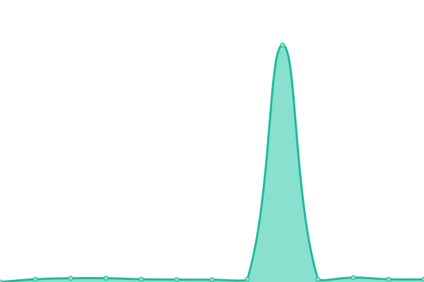
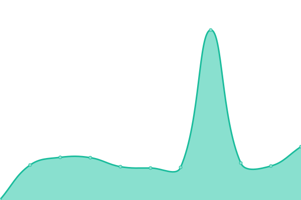

# [📈 Live Status](https://clone47.github.io/ecohub-processes-uptime): <!--live status--> **🟩 All systems operational**

This repository contains the open-source uptime monitor and status page for [Ayon Alfaz](https://clone47.github.io/ecohub-processes-uptime), powered by [Upptime](https://github.com/upptime/upptime).

With [Upptime](https://upptime.js.org), you can get your own unlimited and free uptime monitor and status page, powered entirely by a GitHub repository. We use [Issues](https://github.com/clone47/ecohub-processes-uptime/issues) as incident reports, [Actions](https://github.com/clone47/ecohub-processes-uptime/actions) as uptime monitors, and [Pages](https://clone47.github.io/ecohub-processes-uptime) for the status page.

<!--start: status pages-->
<!-- This summary is generated by Upptime (https://github.com/upptime/upptime) -->
<!-- Do not edit this manually, your changes will be overwritten -->
<!-- prettier-ignore -->
| URL | Status | History | Response Time | Uptime |
| --- | ------ | ------- | ------------- | ------ |
|  [Ecohub Processes Dev](https://giraffe.seliselocal.com) | 🟩 Up | [ecohub-processes-dev.yml](https://github.com/clone47/ecohub-processes-uptime/commits/HEAD/history/ecohub-processes-dev.yml) | 

 506ms
     
 | 

<a href="https://clone47.github.io/ecohub-processes-uptime/history/ecohub-processes-dev">100.00%</a>
    

|  [Gotenberg PDF Generator Dev](http://gutenberg.seliselocal.com/health) | 🟩 Up | [gotenberg-pdf-generator-dev.yml](https://github.com/clone47/ecohub-processes-uptime/commits/HEAD/history/gotenberg-pdf-generator-dev.yml) | 

 2342ms
     
 | 

<a href="https://clone47.github.io/ecohub-processes-uptime/history/gotenberg-pdf-generator-dev">100.00%</a>
    

|  [Giraffe Service Dev](https://giraffe.seliselocal.com/api/business-giraffe/GiraffeService/management/ping) | 🟩 Up | [giraffe-service-dev.yml](https://github.com/clone47/ecohub-processes-uptime/commits/HEAD/history/giraffe-service-dev.yml) | 

 119ms
     
 | 

<a href="https://clone47.github.io/ecohub-processes-uptime/history/giraffe-service-dev">100.00%</a>
    

|  [Ecohub Processes Stg](https://stage-giraffe.selise.biz) | 🟩 Up | [ecohub-processes-stg.yml](https://github.com/clone47/ecohub-processes-uptime/commits/HEAD/history/ecohub-processes-stg.yml) | 

 627ms
     
 | 

<a href="https://clone47.github.io/ecohub-processes-uptime/history/ecohub-processes-stg">100.00%</a>
    

|  [Gotenberg PDF Generator Stg](http://gutenberg.seliselocal.com/health) | 🟩 Up | [gotenberg-pdf-generator-stg.yml](https://github.com/clone47/ecohub-processes-uptime/commits/HEAD/history/gotenberg-pdf-generator-stg.yml) | 

 154ms
     
 | 

<a href="https://clone47.github.io/ecohub-processes-uptime/history/gotenberg-pdf-generator-stg">100.00%</a>
    

|  [Giraffe Service Stg](https://stage-giraffe.selise.biz/api/business-giraffe/GiraffeService/management/ping) | 🟩 Up | [giraffe-service-stg.yml](https://github.com/clone47/ecohub-processes-uptime/commits/HEAD/history/giraffe-service-stg.yml) | 

 114ms
     
 | 

<a href="https://clone47.github.io/ecohub-processes-uptime/history/giraffe-service-stg">100.00%</a>
    

|  [Ecohub Processes IAT](https://processes.test-myecohub.ch) | 🟩 Up | [ecohub-processes-iat.yml](https://github.com/clone47/ecohub-processes-uptime/commits/HEAD/history/ecohub-processes-iat.yml) | 

 561ms
     
 | 

<a href="https://clone47.github.io/ecohub-processes-uptime/history/ecohub-processes-iat">100.00%</a>
    

|  [Ecohub Processes Prod](https://processes.myecohub.ch) | 🟩 Up | [ecohub-processes-prod.yml](https://github.com/clone47/ecohub-processes-uptime/commits/HEAD/history/ecohub-processes-prod.yml) | 

 564ms
     
 | 

<a href="https://clone47.github.io/ecohub-processes-uptime/history/ecohub-processes-prod">100.00%</a>
    

|  [Dummy Site](https://thissitedoesnotexist.koj.co) | 🟩 Up | [dummy-site.yml](https://github.com/clone47/ecohub-processes-uptime/commits/HEAD/history/dummy-site.yml) | 

 0ms
     
 | 

<a href="https://clone47.github.io/ecohub-processes-uptime/history/dummy-site">1.95%</a>
    

<!--end: status pages-->

[**Visit our status website →**](https://clone47.github.io/ecohub-processes-uptime)

## 📄 License

- Powered by: [Upptime](https://github.com/upptime/upptime)
- Code: [MIT](./LICENSE) © [Ayon Alfaz](https://clone47.github.io/ecohub-processes-uptime)
- Data in the `./history` directory: [Open Database License](https://opendatacommons.org/licenses/odbl/1-0/)
